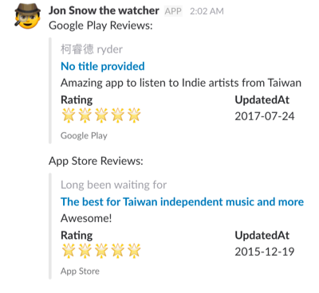
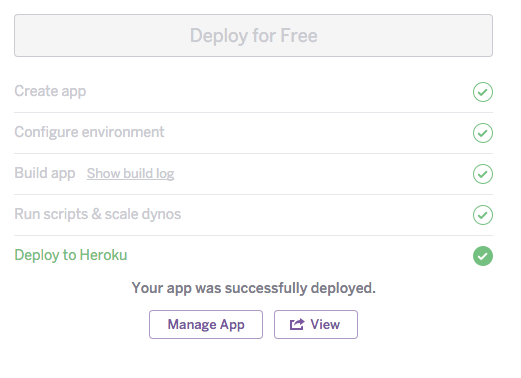
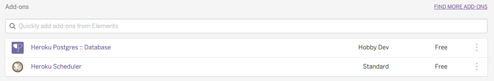
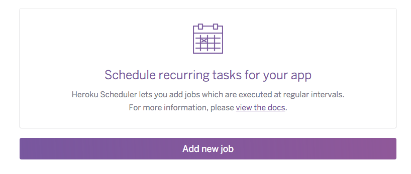
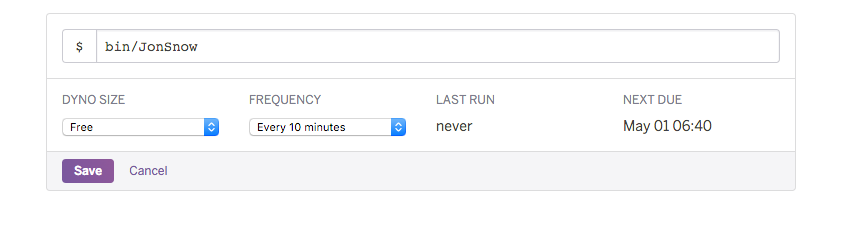

# Jon Snow the watcher
> Jon Snow is elected the 998th Lord Commander of the Night's Watch.

I made it easy for you, build your own monitoring service by one click, few configs. No codes needed.

Deploy your own app to heroku:  
 (targeting tw store)

 (targeting us store)

#### One more thing

Congratulations, you've got slack message after your heroku app deployed.  
One more thing to do, add cron job on your service.

Hit Manage App button  

Hit Heroku Scheduler in Add-ons section  

You will see this page, hit Add new job button  

Fill our command: `$ bin/JonSnow`, select preferred frequency and save.  

DONE.

## Contact
[@saiday](https://twitter.com/saiday)

This project is inspired by [LaunchKit](https://launchkit.io/) and [go-google-play-review-watcher](https://github.com/Konboi/go-google-play-review-watcher)
